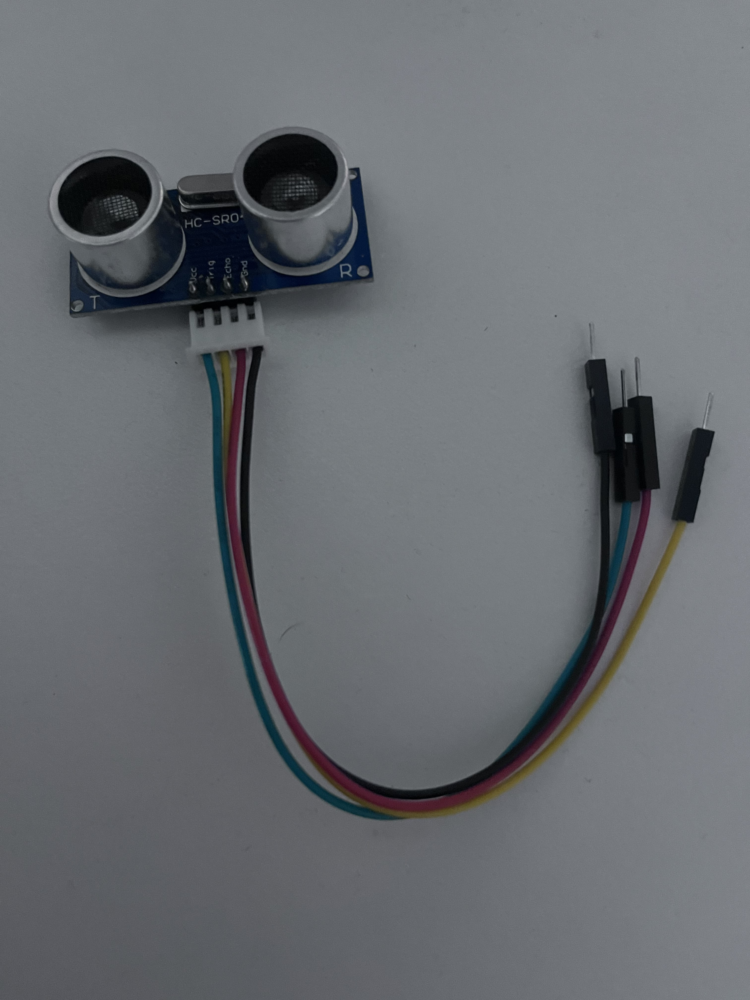

# Waste Disposal Management System :recycle:

## Features

The goal for this system is to figure out how full a waste bin is in percentage. The system takes in a waste bin size, and will then calculate how full the bin is in percentage. The system also only operates when the bin is closed and a LED, green and red will indicate wether the system is operating or if the bin is open and is not operating. When the red LED is open then the system is operating and the bin closed while when the green LED is open the system is not functional and the bin is opened. To open the bin however you must enter a code using a sequence of button presses, buttons that are red and blue. The system starts on open and will have default values such as fill threshold and bin size, predetermined. To change values, you must first open the bin by entering the proper sequence of buttons and then you will be free to change value and access anything in the bin as necessary. To turn the system back on and close the bin you will need to re-enter the button sequence. If ever the bin's lid is open when the system is operational, then an alarm sounds until it is put back on or if the system is shutdown using the code sequence. Whenever the code sequence is wrong, the alarm goes off for 2 seconds and no switch of state happens within the machine. Finally, the waste level will be displayed outside using a bar LED and it will show the bin at its current level of waste, again in percentage.

## Circuit Requirements

### Components:
- Bread Board
- Green LED, red LED, Resistor x2
- Button Module x2
- LED Bar Module
- Ultrasonic Distance Sensor
- Active Buzzer

#### LEDs and Resitors

#### Button Modules

#### LED Bar Module

#### Ultrasonic Distance Sensor

#### Active Buzzer

#### Bread Board

## GUI Mockup

## Block Diagram

